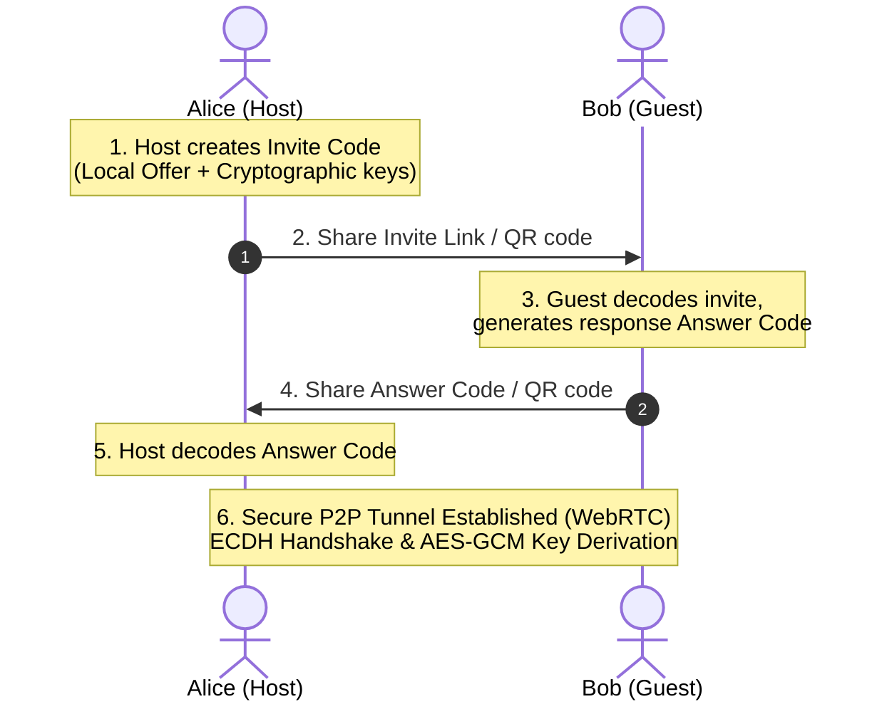

# ⛓️ whisperlink

A sleek, premium, **100% serverless, privacy-focused peer-to-peer (P2P)** encrypted group chat web application that runs entirely in the browser. 

No signaling servers, no databases, zero metadata logging, and complete end-to-end cryptographic security.

## 🚀 Features

- **True Serverless P2P**: Handshakes are compiled into tiny, shareable connection codes using custom micro-SDP compression.
- **End-to-End Encryption (E2EE)**: Transient cryptographic key exchanges are handled inside the browser using **ECDH** key agreements, and messages are encrypted with **AES-GCM-256**.
- **Collapsible Console Inspector**: A built-in monospace log drawer for tactical inspection of ICE gathering and connection handshakes.
- **Micro-SDP Vouchers**: Copy invite URL links or raw connection codes instantly via sleek, inline copy triggers.
- **Instant QR Codes**: Scan invite URLs or raw guest response codes with mobile devices.
- **URL Query Parameter Boarding**: Join rooms instantly via `?invite=...` links.
- **Auto-Process Paste**: Just paste the connection codes — the app handles handshakes automatically without needing manual confirmation clicks.
- **Star Relay Topology**: Supports serverless group chats. The host coordinates the mesh by acting as an encrypted relay point for guest messages.

---

## 🛠️ How It Works (The Handshake)



---

## 💻 Local Development

To run the project locally, serve the directory contents using any static file server:

```bash
# Example using Node's serve:
npx serve -l 8080
```

Open `http://localhost:8080` in your web browser.

---

## 🌐 Deploy to GitHub Pages

Since `whisperlink` is 100% static, it can be hosted on GitHub Pages:

1. Create a **new public/private repository** on GitHub.
2. Link your local project:
   ```bash
   git init
   git add .
   git commit -m "Initial commit of whisperlink"
   git branch -M main
   git remote add origin <your-github-repo-url>
   git push -u origin main
   ```
3. Go to your repository settings on GitHub, navigate to **Pages**, and set the source branch to `main`.
4. Your secure serverless chat will be live at `https://<username>.github.io/<repo-name>/`.

---

## 🔒 Cryptographic Architecture

1. **Key Generation**: Every peer generates a new, ephemeral ECDH keypair (elliptic curve P-256) on startup.
2. **Key Agreement**: Public keys are exchanged over the open WebRTC data channel as soon as the signaling channel connects.
3. **Secret Derivation**: Peers use their private key and the remote public key to derive a shared 256-bit AES secret key.
4. **Encryption**: Message payloads are encrypted using authenticated `AES-GCM` with a cryptographically secure random 12-byte initialization vector (IV) per transmission.
5. **Ephemerality**: All keys reside strictly in transient memory. Closing the browser window or clicking **Disconnect** permanently purges them.
